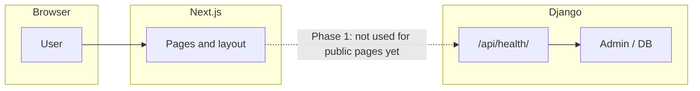

# Hardware Hub — Phase 1 Explained

This document describes **what Phase 1 is**, **how the repository is organised**, and **how the pieces work together** today. For install and deploy commands, see the root [README.md](../README.md).

---

## 1. Full product vs Phase 1

**Long-term goal (from the technical specification)** is a premium multi-brand repair platform for South Africa: online booking, out-of-warranty quotes, payments (e.g. PayFast), RMA uploads, courier collection, repair tracking, Vision ERP integration, corporate B2B portal, admin tools, POPIA-aligned security, and notifications.

**Phase 1 (MVP / Milestone 1)** deliberately delivers only a **foundation**:

- A **public marketing site** with a strong, responsive UI (Home + Services, plus placeholder routes for future flows).
- A **clean, scalable codebase** so later phases can add ERP, payments, and courier APIs without rewriting the shell.
- A **Django REST Framework (DRF) backend** with a **PostgreSQL-ready** database schema (SQLite by default for local development).
- **No** Vision ERP, payment gateway, courier APIs, or authenticated user flows in this phase.

Phase 1 is **structure + presentation + data model stubs**, not the full operational platform.

---

## 2. What Phase 1 includes (deliverables)

| Area | Delivered |
|------|-----------|
| **Frontend** | Next.js 15 (App Router), TypeScript, Tailwind. Global layout: header, footer, main content. |
| **Pages (live UI)** | `/` Home (hero, services overview, CTAs, corporate teaser, OEM placeholders, contact). `/services` — service lines and roadmap note. |
| **Placeholder routes** | `/book-repair`, `/track`, `/corporate`, `/contact` — copy explains future functionality; URLs reserved for later integration. |
| **Backend** | Django 5 project + DRF. JSON health endpoint: `GET /api/health/`. |
| **Database** | PostgreSQL-compatible schema via Django models; migrations included. Local dev often uses SQLite (`USE_SQLITE=true`). |
| **Hosting prep** | Docker Compose file for PostgreSQL; README notes for staging (e.g. frontend on Vercel, API on Railway/Render). |

---

## 3. Repository layout

```
hardware hub/
├── frontend/          # Next.js app (customer-facing website)
├── backend/           # Django + DRF API
├── docker-compose.yml   # Optional PostgreSQL for local/staging-style DB
├── README.md            # Quick start and deployment notes
└── docs/
    └── PHASE1.md        # This file
```

---

## 4. How the frontend works

- **Framework:** Next.js uses the **App Router** (`frontend/src/app/`). Each folder with a `page.tsx` becomes a route (e.g. `app/services/page.tsx` → `/services`).
- **Layout:** `app/layout.tsx` wraps every page with `SiteHeader`, `<main>{children}</main>`, and `SiteFooter`. Shared fonts (Geist) and global CSS are applied here.
- **Components:** Reusable pieces live under `frontend/src/components/` (e.g. `layout/SiteHeader.tsx`, `ui/Section.tsx`, `ui/ButtonLink.tsx`). The design goal is a **minimal, premium** look: simple palette, generous spacing, mobile + desktop responsive behaviour.
- **Data:** Phase 1 pages are mostly **static** or **placeholder copy**. The frontend does **not** yet call the Django API for user-facing features (that comes when booking, tracking, and auth are built).

**How requests flow:** A user opens `https://hardware-hub.co.za` (or local `http://localhost:3000`). The Next.js server (or static build) serves HTML and assets. No repair job is created in the browser during Phase 1.

---

## 5. How the backend works

- **Framework:** **Django** handles HTTP, routing, the admin site, and the ORM. **Django REST Framework** adds JSON APIs for future clients (web app, mobile, integrations).
- **Entrypoint:** `backend/manage.py` runs commands (`runserver`, `migrate`, etc.). Django settings live in `backend/config/settings.py`.
- **URL routing:** `config/urls.py` mounts the admin at `/admin/` and API routes under `/api/` (see `backend/apps/api/urls.py`).
- **Apps:**
  - **`apps.api`** — API views (e.g. health check).
  - **`apps.core`** — Domain models intended to grow with the platform.

**Health check:** `GET /api/health/` returns JSON such as `status`, `service` name, and server time. Use it to confirm the API process is running (load balancers, monitoring, staging checks).

---

## 6. Database schema (Phase 1)

Models are defined in `backend/apps/core/models.py` and applied via migrations. They are **foundational**, not yet wired to the public booking UI.

| Model | Purpose (Phase 1) |
|-------|-------------------|
| **DeviceCatalog** | Placeholder rows for future **device identification** and quote logic (brand, model). |
| **RepairJob** | Core repair record (reference, status, optional device link, customer email, timestamps). Status values align with the future tracking story (e.g. received, under assessment, repair in progress). |
| **AuditLog** | Lightweight **audit trail** stub for future POPIA-related logging. |

**Switching to PostgreSQL:** Set `USE_SQLITE=false` and provide `POSTGRES_*` variables (see `backend/.env.example`). Run migrations against the same schema.

---

## 7. How frontend and backend connect today



- **Phase 1:** The public site **does not depend** on the API for rendering. You can run **only** the frontend (`npm run dev`) and browse the site.
- **CORS:** The backend is configured to allow the Next.js dev origin so that when you add `fetch` or React Query later, **local** integration is straightforward.
- **Production:** Typically the frontend and API are on **different origins** (e.g. `app.hardware-hub.co.za` and `api.hardware-hub.co.za`). You will set `CORS_ALLOWED_ORIGINS` and `DJANGO_ALLOWED_HOSTS` accordingly.

---

## 8. What is explicitly out of scope for Phase 1

- Vision ERP integration (warranty, job creation, status sync).
- PayFast or other payment gateways.
- Courier APIs (Courier Guy, RAM, etc.).
- File uploads to cloud storage for RMA / photos.
- Email/SMS notification pipelines.
- Corporate B2B portal, admin dashboards, role-based auth (beyond Django admin for staff).

These are planned for **later milestones** on top of this codebase.

---

## 9. Summary

**Phase 1** is the **marketing foundation** and **technical skeleton**: Next.js + DRF + PostgreSQL-ready models, a polished Home and Services experience, placeholder routes for future flows, and a health API to prove the backend is alive. Understanding this split avoids expecting booking or ERP behaviour on the live site until those phases are implemented.

---

*Last updated to align with the Phase 1 MVP scope as described in the project brief.*
